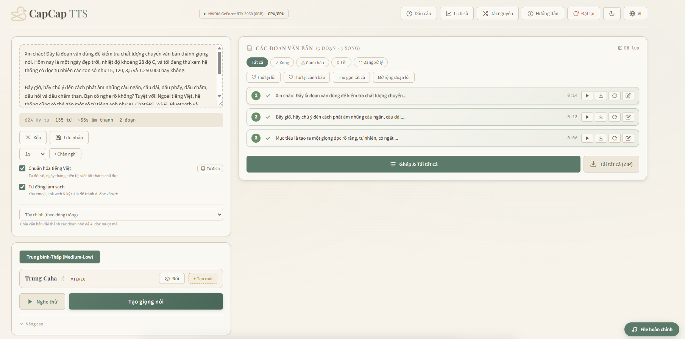

# CapCap TTS — Bộ Chuyển Đổi Văn Bản Thành Giọng Nói Tiếng Việt

<p align="center">
  <a href="README_EN.md">English</a> | <b>Tiếng Việt</b>
</p>

> **100% Miễn phí · Chạy 100% Offline trên máy · Không cần API Key · Không giới hạn**

Ứng dụng desktop và web service chuyển đổi văn bản thành giọng nói tiếng Việt tự lưu trữ (Self-hosted). Chạy hoàn toàn cục bộ trên máy tính, bảo mật tuyệt đối, không gửi bất kỳ dữ liệu nào ra bên ngoài.



---

## 4 Phân Hạng Giọng Đọc

| Phân hạng | Mô hình | Tần số mẫu | Tốc độ | Chất lượng | Yêu cầu phần cứng |
|---|---|:---:|:---:|:---:|---|
| **Thấp (Low)** | **Piper** | 22.05 kHz | ⚡⚡⚡ Cực nhanh | Khá | Mọi CPU |
| **Trung bình-Thấp (Medium-Low)** | **VieNeu-TTS** | **48.0 kHz** | ⚡⚡ Nhanh | Rất tốt (Truyền cảm) | CPU hoặc GPU |
| **Trung bình (Medium)** | **F5-TTS** | 24.0 kHz | ⚡ Trung bình | Xuất sắc (Clone giọng) | GPU NVIDIA (4GB+) |
| **Cao (High)** | **OmniVoice** | 24.0 kHz | ⏳ Chậm | Tốt nhất | GPU NVIDIA (6GB+) |

- **Piper**: 25 giọng đọc vùng miền (Bắc, Trung, Nam).
- **VieNeu**: 20 giọng mặc định (10 Nam, 10 Nữ) + hỗ trợ Clone giọng.
- **F5-TTS & OmniVoice**: Dùng chung kho giọng mẫu và giọng clone cá nhân.

---

## Các Tính Năng Chính

- **Chuẩn hóa tiếng Việt**: Đọc chuẩn số, ngày tháng, tiền tệ, từ viết tắt qua `vietnormalizer`.
- **Quản lý & Tải tài nguyên**: Tải tự động 1-click trong app, ⚡ **Mirror tăng tốc (`hf-mirror.com`)**, hướng dẫn tải thủ công kèm nút mở thư mục, tùy chọn ổ đĩa lưu trữ.
- **Cắt đoạn linh hoạt**: Cắt thông minh (Hybrid - mặc định ghép câu ngắn/tách câu dài), cắt theo câu, hoặc theo đoạn.
- **Kiểm soát từng câu**: Gán giọng đọc riêng cho từng câu trong bài; tạo lại riêng lẻ từng câu.
- **Kiểm tra chất lượng tự động**: Phát hiện nuốt tiếng, âm lượng nhỏ, khoảng lặng dài, vỡ tiếng (clipping).
- **Xử lý hàng loạt (Batch)**: Kéo thả nhiều file `.txt`/`.md` cùng lúc với cấu hình riêng hoặc chung.
- **Xuất file đa dạng**: Tải từng câu WAV, tải ZIP toàn bộ, ghép thành MP3 (128k/320k), WAV và phụ đề SRT.
- **Clone giọng nói**: Tạo giọng clone mới chỉ với một file audio mẫu 3–10 giây.
- **Từ điển & Khoảng nghỉ**: Tự định nghĩa phiên âm từ viết tắt, tiếng nước ngoài và chỉnh độ trễ dấu câu (`[1s]`, `[0.5s]`).
- **Giao diện Song ngữ & Dark Mode**: Đổi qua lại tức thì giữa Tiếng Việt và Tiếng Anh.

---

## Khuyến Nghị Cấu Hình

| Cấu hình máy | Bản sử dụng | Các phân hạng hỗ trợ |
|---|---|---|
| **GPU NVIDIA (VRAM từ 6GB trở lên)** | `backend/` (Bản GPU) | Đầy đủ cả 4 phân hạng (Low, Medium-Low, Medium, High) |
| **GPU NVIDIA (VRAM 4GB)** | `backend/` (Bản GPU) | 3 phân hạng: Low, Medium-Low, Medium |
| **Chỉ có CPU / MacBook / Card AMD** | `backend_cpu/` (Bản CPU) | 2 phân hạng: Low (Piper) & Medium-Low (VieNeu ONNX) |

---

## Hướng Dẫn Cài Đặt & Khởi Chạy

### Yêu cầu tiên quyết
- **Python 3.11+** (đã tích chọn "Add Python to PATH")
- **FFmpeg** (đã cài đặt và thêm vào PATH hoặc đặt trong `config.py`)

### 1. Ứng dụng Desktop (Electron — Khuyến nghị)

```bash
npm install

# Chạy thử (Development)
npm run start:cpu   # Chế độ CPU (Piper + VieNeu)
npm run start:gpu   # Chế độ GPU (Đầy đủ engine)

# Đóng gói bộ cài đặt Windows (.exe)
npm run build:cpu
npm run build:gpu
```

### 2. Chạy dưới dạng Web Server

```bash
# Bản GPU
cd backend && pip install -r requirements.txt && python main.py

# Bản CPU
cd backend_cpu && pip install -r requirements.txt && python main.py
```
Mở trình duyệt truy cập: `http://localhost:8000`.

---

## Tải Mô Hình & Tài Nguyên

Bạn có thể tải trực tiếp trong mục **Tài nguyên** của ứng dụng, hoặc tải thủ công:

| Mô hình | Dung lượng | Nguồn tải |
|---|:---:|---|
| **Piper Voices** | ~1.5 GB | [Hacht/CapCapResource (piper-new)](https://huggingface.co/Hacht/CapCapResource/tree/main/piper-new) |
| **VieNeu-TTS** | ~330 MB | [pnnbao-ump/VieNeu-TTS-v3-Turbo](https://huggingface.co/pnnbao-ump/VieNeu-TTS-v3-Turbo) |
| **Mẫu giọng tham chiếu** | ~1.8 MB | [Hacht/CapCapResource (f5_voice)](https://huggingface.co/Hacht/CapCapResource/tree/main/f5_voice) |
| **F5-TTS Model** | ~1.3 GB | [Hacht/CapCapResource (f5_model)](https://huggingface.co/Hacht/CapCapResource/tree/main/f5_model) |
| **OmniVoice Model** | ~2.3 GB | [kjanh/KhanhTTS-OmniVoice](https://huggingface.co/kjanh/KhanhTTS-OmniVoice) |

> ⚡ **Mẹo**: Bật tùy chọn **"Sử dụng Mirror tăng tốc (hf-mirror.com)"** trong ứng dụng nếu đường truyền quốc tế bị chậm.

---

## Danh Sách API Chính

| Phương thức | Endpoint | Chức năng |
|---|---|---|
| `GET` | `/tts/voices` | Lấy danh sách giọng đọc theo phân hạng (`low`, `turbo`, `medium`, `high`) |
| `POST` | `/tts/preview` | Nghe thử giọng nhanh |
| `POST` | `/tts/generate` | Tạo âm thanh từ văn bản |
| `GET` | `/tts/status/{task_id}` | Theo dõi tiến độ & kiểm tra chất lượng phân đoạn |
| `POST` | `/tts/merge` | Ghép các đoạn thành file MP3/WAV/SRT |
| `POST` | `/tts/regenerate_chunk` | Tạo lại một phân đoạn cụ thể |
| `GET` | `/tts/download_file` | Tải file âm thanh hoàn chỉnh |
| `POST` | `/tts/clone` | Đăng ký giọng clone mới |
| `DELETE` | `/tts/voices/{id}` | Xóa giọng clone cá nhân |
| `GET/POST` | `/tts/settings` | Lấy / cập nhật thư mục lưu tài nguyên & Mirror |
| `GET` | `/tts/resource_catalog` | Trạng thái & thông tin tải mô hình |
| `POST` | `/tts/download_resource` | Kích hoạt tải tự động mô hình ngầm |
| `GET/POST/DELETE` | `/tts/dict/acronyms` | Quản lý từ điển từ viết tắt |
| `GET/POST/DELETE` | `/tts/dict/words` | Quản lý từ điển phát âm riêng |

---

## Cấu Trúc Thư Mục

```
TTS/
├── backend/            # Backend GPU (FastAPI, PyTorch, F5-TTS, OmniVoice, VieNeu)
├── backend_cpu/        # Backend CPU gọn nhẹ (ONNX Runtime, Piper, VieNeu)
├── frontend/           # Giao diện Web, trình phát âm thanh, bộ song ngữ i18n
├── electron/           # Tiến trình chính Electron và scripts khởi chạy
├── electron-builder.base.cjs # Cấu hình đóng gói installer Windows
└── setup_portable.bat  # Script tự động tạo môi trường Python portable
```

---

## Bản Quyền & Tham Khảo

- Giấy phép: [Apache 2.0](./LICENSE)
- Tham khảo & xây dựng trên: [VieNeu-TTS](https://huggingface.co/pnnbao-ump/VieNeu-TTS-v3-Turbo), [OmniVoice](https://huggingface.co/kjanh/KhanhTTS-OmniVoice), [F5-TTS](https://github.com/nguyenthienhy/F5-TTS-Vietnamese), [vietnormalizer](https://github.com/nghimestudio/vietnormalizer), [Piper](https://github.com/rhasspy/piper).
